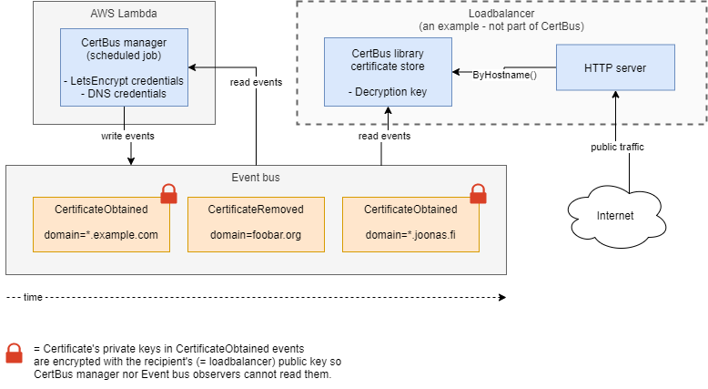

[](https://travis-ci.org/function61/certbus)
[](https://bintray.com/function61/dl/certbus/_latestVersion#files)

CertBus is an event bus that keeps your TLS certificates updated.



Contents:

- [Why?](#why)
- [How](#how)
- [Installation](#installation)
- [Certificate management](#certificate-management)


Why?
----

A modern loadbalancer needs to keep a large amount of TLS certificates up-to-date.

One type of approach could be for your loadbalancer to be in charge of managing the certificates.
This is how [Caddy](https://github.com/caddyserver/caddy) (internally
[CertMagic](https://github.com/mholt/certmagic)) does it.

I don't like the above approach for these reasons:

- Loadbalancer needs to have complicated logic for renewing certificates on time
- Loadbalancer needs a stateful store to keep track of the ever-changing certs
- Loadbalancer needs your LetsEncrypt (or some other ACME service) credentials
- Loadbalancer needs your DNS credentials if you need private (think intranet) services
    * You need DNS solver because ACME can't verify your domain ownership via HTTP solver for private services

CertBus's approach is different:

- Keep most of the logic, state and sensitive credentials elsewhere
    * Run CertBus's manager component on AWS Lambda or in-house.
- Loadbalancer does the bare minimum to obtain the latest certificates
    * Only depends on the event bus (backed by AWS DynamoDB) and we keep local copy of the
      state via snapshots so the bus going offline doesn't affect your HTTP services -
      not even across loadbalancer restarts.

Messages on the bus are durable and offer exactly-once semantics for the certificate events.
Event writing to the bus uses optimistic locking to provide consistency for the data.


How
---

Demo integration with loadbalancer:

```go
    srv := &http.Server{
        Addr: ":443",
        TLSConfig: &tls.Config{
            // this integrates CertBus into your server - certificates are fetched
            // dynamically from CertBus's dynamically managed state
            GetCertificate: certBus.GetCertificateAdapter(),
        },
    }
```

View [more complete example](pkg/cbexampleserver/example.go).


Installation
------------

1. [Setting up the bus](docs/setting-up-bus.md) (EventHorizon + AWS DynamoDB)
2. [Configure CertBus manager](docs/configure-manager.md)
3. [Test the example server using CertBus](docs/test-example-server.md)
    * Once it works, use the example code to integrate with your loadbalancer


Certificate management
----------------------

These steps are done from CertBus-manager.

Let's run through a certificate management lifecycle:

- Issue first certificate for a domain
- Renew it
- Remove

```console
$ certbus cert mk --wildcard yourdomain.com
```

(if you don't use `--wildcard`, you'll get cert assigned for `yourdomain.com, www.yourdomain.com`)

Now check that the certificate exists:

```console
$ certbus cert ls
nd3oD6CfiY0 *.yourdomain.com, yourdomain.com
```

The first value (`nd3oD6CfiY0`) is the **managed certificate's ID**. The "managed" refers to
a single domain's timeline of certs. Certificates come and go as they're renewed, but this ID
stays the same even when certs are rotated.

Now let's suppose the certificate is nearing expiration. You can renew any certs pending
renewal (NOTE: usually this is hooked up to cron or Lambda scheduler so it's done automatically):

```console
$ certbus cert renewable --renew-first
nd3oD6CfiY0 *.yourdomain.com, yourdomain.com
... lots of output about renewing certificate ...
```

Note: `--renew-first` means it renews the first cert that is due for renewal. Without it
it's just a dry run.

Currently we only support renewing one. It's assumed that one doesn't have hundreds of
certs renewable at a given time, so a cron ticking every 5 minutes would have throughput
of 12 renewed certs per hour anyway. (Batching will probably be implemented later, though.)

Now, you don't need that domain anymore - we will stop managing & renewing the cert:

```console
$ certbus cert rm nd3oD6CfiY0
```
